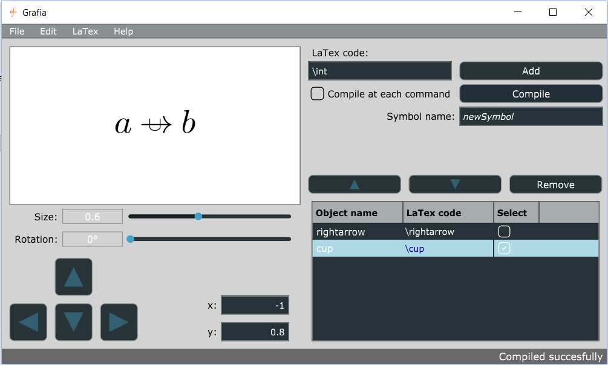



# Grafia

[](https://www.gnu.org/licenses/gpl.html)

## Abstract
The purpose of the software being developed in this repository is to implement graphically a functionality of the LaTeX language, that is to say inventing a new symbol.

## Introduction
The idea came to me when I needed to implement cool tables in LaTeX for a course project at university and, googling, I found that even though making tables is not hard at all there is a great deal of possibilities that can make them look much more professional. I began opening webpages to look for cool options to use but I felt almost immediately lost through all the possible packages and versions. It seemed that each user on forums suggested different packages and had different tips. There was also the problem that some of the information was outdated and that it took a long time to extricate oneself from the whole situation.
At some point I found an Excel extension that allowed to export an Excel table (obviously with the whole graphic implementation) in LaTeX code. That looked to me like a very smart idea, as it put together the advantage of WYSIWYG, that is the ease and intuitiveness (allowing the user not to spend three hours to compile a decent looking table) with that of WYSIWYM, that is being able to work at low level and get the whole control on the document. Indeed, even if the table was built with excel, the final result was LaTeX code, so that user’s modifications were easy. Also, the user is provided with a starting point that looks like what he wants already. I also liked that this way, who wrote the code put his LaTeX experience at the service of the community by incorporating in the code the whole research on the LaTeX packages that otherwise each user should have done by himself.
Summarizing, the philosophy is: let’s help the user save hours of his/her time to implement basic functionalities by offering through a software some LaTeX experience on the argument, hoping also that this might lead to a more professional result.

Having not found anything similar for mathematical symbols creation, I decided to make it on my own, and here it is.

## Getting Started
These instructions should get you a copy of the project up and running on your local machine.

### Prerequisites
Windows 8.1 or a newer version. Any Linux distribution. Moreover this software has two dependencies:
* an installation of LaTeX that has at least the command _pdflatex_.
* an installation of Ghostscript which can be downloaded at [this link](https://www.ghostscript.com/download/gsdnld.html) (on Linux it might not be necessary).

### Setup
The installation differs depending on the operative system. Whatever is your OS download and unpack the appropriate file from the latest release [here](https://github.com/Nicknamen/Grafia/releases). Then follow the instructions for your OS.
#### Windows
On windows it is pretty straightforward. Just open GrafiaSetup.msi and follow the wizard. Once this is completed you should find Grafia on your desktop.
#### Linux
On Linux you must install some additional dependencies first, namely _libwebkit2gtk libomp5 libgraphicsmagick_. For example, on Ubuntu run:
```
	sudo apt install -y libwebkit2gtk-4.0-37
	sudo apt install -y libomp5
	sudo apt install -y libgraphicsmagick-q16-3
```
on other Linux distributions use the appropriate installer.
Then unpack the downloaded archive on your home directory, enter the folder, open the terminal and run the following command
```
sudo ./installGrafia.sh
```
You should then be able to use the application as a standard native application.



## How the software works
This application generates the code of a new LaTeX symbol by overlapping existing ones, changed at most by a similarity (that is an affine transformation of which the vector space matrix belongs to *O(2)*, even if by now only on from *SO(2)* is implemented).

Component symbols are added by typing the relative TeX code in the **LaTeX code** text editor and pressing either *Add* or the enter key. When all the necessary components are listed in the bottom right table, the component symbol attributes can be displayed by clicking on its LaTeX code cell. The first symbol of the list is dominant: it cannot be translated, but rather all the other symbols are translated with respect to this one. It can all the same be resized and rotated. To select a symbol click on it or on its box and to deselect it untick its box. To move a selected symbol use the arrow buttons on top of the table (or change manually the numerical value of its coordinates). The remove button removes all the selected component symbols.

> <b>Note</b>: even if modifications are displayed numerically only for the displayed component symbol, they are applied proportionally to all selected symbols, so be careful about selecting and deselecting the appropriate component symbols.

To select all symbols, click on "Select" on the table header. To deselect them all, click on it 2 times. When ready to see the result click on compile button (you can click it as many times as you want, it takes approximately 8 seconds on a modern average computer with Windows, 2 on one with Linux). If you tick "Compile at each command" the final symbol will be displayed at each modification (I suggest using this feature on Linux only). Once the symbol is ready you can type its name (that will also be its new LaTeX code: *newSymbol* will be called by $\newSymbol$) in the appropriate editbox. You can also save the project by clicking on File->Save, which will save it with a *.grproj* extension, the proper extension recognized by Grafia. A saved *.grproj* file can be opened just by double clicking on it, or through the appropriate File->Open functionality. You can also export the symbol in TeX by clicking on LaTeX->Export. This will create a minimal TeX file that will be able to compile the command. You can copy and paste the appropriate symbol defining TeX code in your own TeX file, so to use it. In the TeX file it will be indicated which is the defining code. In Edit->Settings you will find some display settings.

Hope you enjoy this application!

## License
This project is licensed under GNU general public license. See the license file for details.
