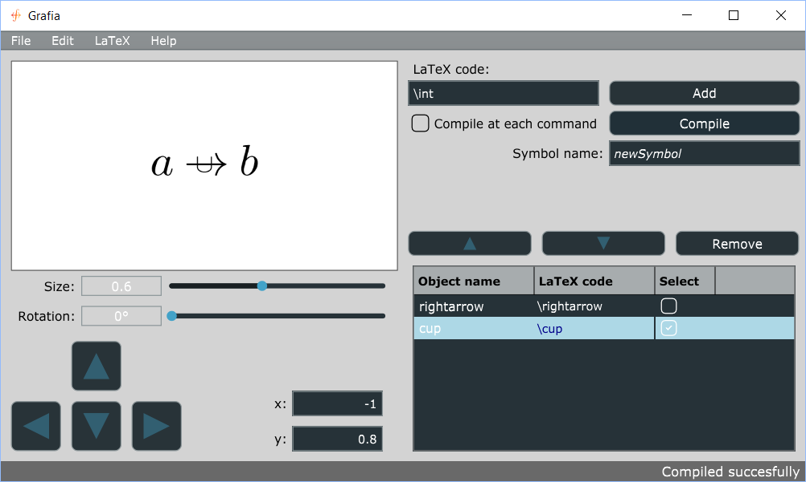

# Grafia

## Abstract
The purpose of the software being developed in this repository is to implement a functionality of the LaTeX language, that is inventing a new symbol.

## Introduction
The idea came to me when I needed to implement cool tables in LaTeX for a course project at university and, googling, I found that even though making tables is not hard at all there is a great deal of possibilities that can make them look much more professional. I began opening webpages to look for cool options to use but I felt almost immediately lost through all the possible packages and versions. It seemed that each user on forums suggested different packages and had different tips. There was also the problem that some of the information was outdated and that it took a long time to extricate oneself from the whole situation.
At some point I found an excel extension that allowed to export an excel table (with obviously the whole graphic implementation) in LaTeX code. That looked to me like a very smart idea, as it put together the advantage of WYSIWYG, that is the ease and intuitiveness (allowing the user not to spend three hours to compile a decent looking table) with that of WYSIWYM, that is being able to work at low level and get the whole control on the document. Indeed, even if the table was built with excel, the final result was LaTeX code, so that user’s modifications were easy. Also, the user is provided with a starting point that looks like what he wants already. I also liked that this way, who wrote the code put his LaTeX experience at the service of the community by incorporating in the code the whole research on the LaTeX packages that otherwise each user should have done by himself.
Summarizing, the philosophy is: let’s help the user save hours of its time to implement basic functionalities by offering some LaTeX experience on the argument, hoping also that this might lead to a more professional result.

Having not found anything similar for mathematical symbol creation, I decided to write it, and here it is.

## Getting Started
These instructions will get you a copy of the project up and running on your local machine for development and testing purposes.

### Prerequisites
Windows 8.1 or a newer version. Any Linux distribution. An installation of LaTeX is also required, that has at least the command "pdflatex".

### Setup
Work in progress... I'm trying to develop an installer for Windows and a script for Linux

## How the software works
This application generates the code of a new LaTeX symbol by overlapping existing ones, changed at most by a similarity (that is an affine transformation of wich the vector space matrix belongs to O(2). Actually by now only SO(2) is implemented).

Component symbols are added by typing the relative TeX code in the "LaTeX code" text editor and pressing either Add or enter. When all the necessary components are in the bottom right table, the component symbol attributes can be displayed by clicking on its LaTeX code cell. The first symbol of the list is dominant: it cannot be translated, but rather all the other symbols are translated with respect to this one. It can all the same be resized and rotated. To move a symbol just click on it and use the arrow buttons on top of the table. The remove button removes all the selected component symbols.

> <b>Note</b>: even if modification are displayed numerically only for the displayed component symbol, they are applied proportionally to all selected symbols, so be careful about selecting and deselecting the appropriate component symbols.

To select all symbols click on "Select" on the table header. To deselect them all click on it 2 times. When ready to see the result click on compile button (you can click it as many times as you want, it takes approximately 8 seconds on windows, 2 on linux). If you tick "Compile at each command" the final symbol will be displayed at each modification. Once the symbol is ready you can type its name (that its new LaTeX code: newSymbol will be called by $\newSymbol$) in the appropriate editbox. Then you can save the project by clicking on File->Save, wich will save it in the grproj extension, the proper extension recognised by grafia. A saved .grproj file can be opene just by double clicking on it, or through the apposite File->Open functionality. You can also export the symbol in TeX by clicking on LaTeX->Export. This will create a minimal TeX file that will be able to compile the command. You can copy and paste the appropriate symbol TeX code in your own TeX file, so to use it. In Edit->Settings you will find some display settings.

Hope you enjoy this application!

## License
This project is licensed under GNU general public licence. See the licence file for details.
